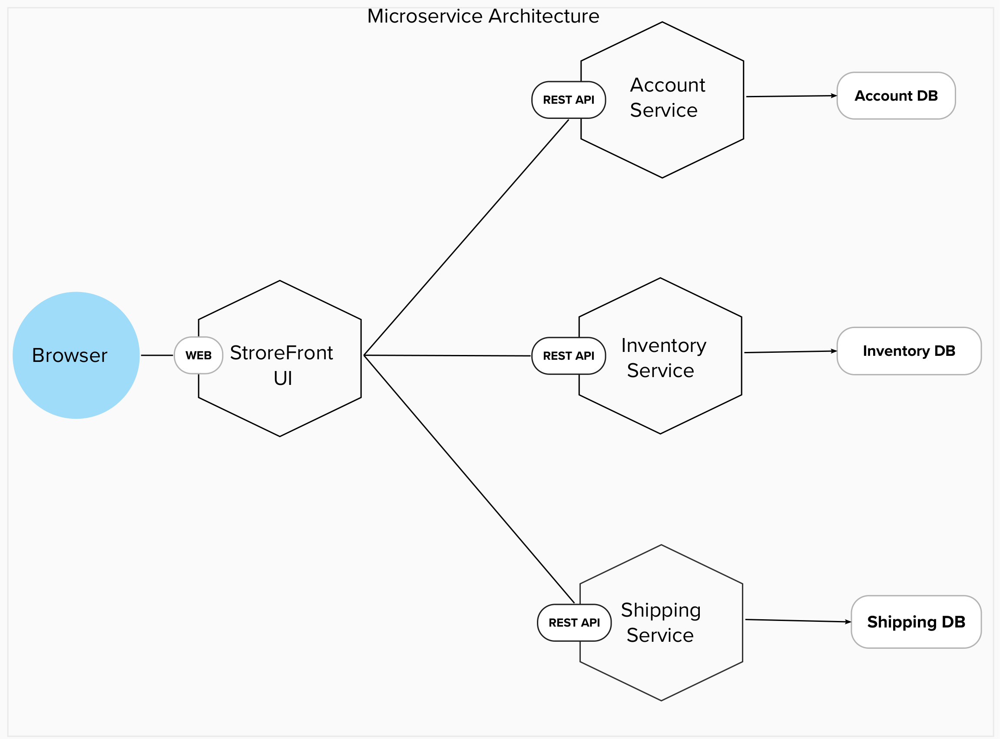

# When And When Not To Choose Microservice Architecture.

## Index

1. What is microservices architecture?
2. What is monolithic architecture?
3. Architectural diagrams for microservices and monolithic architectures.
4. Advantages and Disadvantages of Microservices.
5. Advantages and Disadvantages of Monolithic.
6. Tabular difference of monolithic and microservices.
7. Why projects are moving towards microservices.
8. Why projects are sticking with monolithic.
9. What questions to ask to decide if someone needs microservices or not.
10. What is the conclusion of our research.
11. References.

## 1. What is microservices architecture

An architecture that structures the application as a set of independently deployable, loosely coupled, components, a.k.a. services. Each service consists of one or more subdomains.

Some operations will be local (implemented by a single service), while others will be distributed across multiple services. A distributed operation is implemented using either synchronously using a protocol such as HTTP/REST or asynchronously using a message broker, such as Apache Kafka.

### Basic features of microservices architecture

- Simple services dealing with one or more subdomains of the application.
- Team autonomy allows people with different experiences to develop application.
- Fast deployment (Independent microservice should not take long time to deploy).
- Segregation based on characteristic such as cpu, gpu consumption scalability
- Design should allow most of the distributed operations to be efficient.
- It should allow transactions to be ACID not BASE.
- Loose run time coupling (one service should not be dependent on availability of another service).
- Loose design time coupling (packaging tightly coupled services together).

## 2. What are monolithic applications

An architecture that structures the application as a single deployable and executable component.The component contains all of the application’s subdomains. Since there’s a single component, all operations are local.

### Basic features of monolithic architecture

- The component contains all of the application’s subdomains.
- Since there’s a single component, all operations are local.
- Simple to develop (as designing/understanding this architecture doesn't take much time and helps for applications in starting stages of development).
- Testing is simple (as everything is at one place).
- Deployment of the whole application is done in case of changes.
- One has to run multiple instances of the application using load balancer in order to scale and improve availability of the application.
- All operations can be implemented as an ACID transaction since there’s a single database.
- There’s no runtime coupling and design-time coupling as there are no multiple components.

## 3. Architectural diagrams for microservice and monolithic architectures.

The increasing business complexity and demand for highly scalable applications have brought a paradigm shift in how software applications are engineered. In the past few years, different software architectures are adopted by developers to reduce code complexity, improve fault isolation, and minimize time-to-market.
Software architecture defines and structures a solution in a way that it meets all the technical, operational and business requirements. It is a foundation for the attributes of an application, its elements, relationships, and properties, which ultimately impacts its scalability and performance.

Two of the popular software architecture approaches that developers prefer are:

- Monolithic architecture
- Microservices architecture

Now let's see these architectures with an example,

The demand of online shopping in increasing rapidly. People prefer to buy products virtually rather than going to the market. On Demand E-commerce App Development companies develop many E-commerce mobile apps that help users to buy anything they want without any hassle.

Let’s imagine that you are building an e-commerce application that takes orders from customers, verifies inventory and available credit and ships them. The application consists of several components including the StoreFrontUI, which implements the user interface, along with some backend services for checking credit, maintaining inventory and shipping orders.  

### Sample Illustration of Monolith architecture of E-Commerce website

The application is deployed as a single monolithic application. A web application consists of a single file that runs on a server. A Rails application consists of a single directory hierarchy deployed using either, for example, Phusion Passenger on Apache/Nginx or JRuby on Tomcat. You can run multiple instances of the application behind a load balancer in order to scale and improve availability.

### Sample Illustration of Microservices architecture of E-Commerce website

The above architecture consist of a user interface, routing layer(API gateway), several services that provides specific e-commerce functionalities(Account service, Inventory service, Shipping services and others) and database for each service for data storage and retrieval.

## 4. Advantages and Disadvantages of Microservice.

### Advantages

- Scalability :- Scalability is one of the most significant benefits of microservices.In a microservices application each service has its dedicated resources. So we can scale up only the required services. This improved scalability helps prevent outages and ensures that users always have a positive experience. It also helps to bring the cost down as you don't need to scale everything if one component is getting high traffic.

- Fault Isolation :- With a microservices architecture, the failure of one service is less likely to negatively impact other parts of the application because each microservice runs independently of others.

- Language and Technology Agnostic :- When creating a microservices-based application, developers can connect microservices programmed in any language. They can also connect microservices running on any platform. This offers more flexibility to use the programming languages and technologies that best fit the project’s needs and your team’s skill sets. By becoming programming language agnostic, you can quickly adopt new technologies as they emerge and evolve. You’re no longer tied to a single technology stack because you can use the best tool for each job.

- Faster Time to Market :- The pluggability of a microservices application architecture allows for easier, faster application development and upgrades. Developers can quickly build or change a microservice, then plug it into the architecture with less risk of coding conflicts and service outages. Moreover, due to the independence of each microservice, teams don’t have to worry about coding conflicts, and they don’t have to wait for slower-moving projects before launching their part of the application. Faster CI/CD cycles help in this process.

- Better Data Security :- Each service in microservices is responsible for a specific task and uses their own database. This approach is far more secure than storing all data in a single monolithic database accessible by the entire application.

### Disadvantages

- Development sprawl :- Microservices add more complexity compared to a monolith architecture, since there are more services in more places created by multiple teams. If development sprawl isn’t properly managed, it results in slower development speed and poor operational performance.They also have a limited ability to reuse code, which can lead to increased development time and costs because microservices are typically written in multiple programming languages and use different technology stacks

- Exponential infrastructure costs :- With each microservice we add in our project the cost for hosting infrastructure, monitoring tools, and other stuff increases as well. This cost can be too much if your project is just starting out.

- Testing and debugging :- While maintaining unit tests in a service is easier it is much harder to write and maintain integration or end to end tests. Moreover, a distributed operation taking place over the course of multiple microservices can be hard to debug. A developer needs to sort through the logs of multiple services to figure out which service actually has the bug.

- Dependency on DevOps :- In order to be successful with microservices, organizations need to have a strong DevOps team in place. This is due to the fact DevOps is responsible for deploying and managing microservices. Without a good DevOps team, it can be difficult to successfully implement and manage a microservice-based application.

- Added organizational overhead :- Teams need to add another level of communication and collaboration to coordinate updates and interfaces. As more services are introduced, so are the number of teams running those services. Over time it becomes difficult to know the available services a team can leverage and whom to contact for support. It's hard to onboard new people to the system.

## 5. Advantages and Disadvantages of Monolithic.

### Advantages

- Simple to develop and deploy - In initial stage it is easy to develop because all the components of the application are developed together. So, developer don't need to deal with complex inter-communication between systems or manage multiple code-bases. Since all the code is at one place we only need to deploy a single application which makes it really easy to deploy.

- Easy to test and debug - Testing a monolith application end to end is very easy since a single process is responsible for completion of a request. As all the operations are taking place in a single process it makes debugging a lot easier since we don't need to go through logs of multiple processes to identify a bug.

- Easy to onboard new member - As all the code is at a single place and is written in one language. It's easy for a new team member to get a functional flow of the entire system.

- Low cost and time for initial setup - As there is single application we need to setup only one service so it won't take much time for initial setup as compare to a distributed system. Since there is single process we can share the resources so it won't cost much.

- Cross-cutting concerns and customizations - Cross cutting concerns refers to aspect of software development that affects multiple parts of an application such as logging mechanism, security, exception handling, setup for database connection pools. We only need to set these up once.

### Disadvantages

- Difficult to scale :- Monolithic applications can be difficult to scale, especially as they grow in size and complexity. This is because all of the components in a monolithic application share the same resources, such as memory, CPU, and local-storage. In monolithic architecture it is impossible to scale a single component on it's own. We are forced to allocate extra resources to the entire system.

- Single point of failure :- A monolithic application has a single point of failure, meaning that if any one component fails, the entire application will fail. This can be a major problem for applications that require high availability.

- Barrier to technology adoption :- A monolith is constrained by the technologies already used in the monolith. You cannot easily introduce new tools even if they are better for the problem at hand. Adopting a newer technology into the system is also difficult and a lot of planning is required to incorporate new technologies.

- Slower Delivery :- Every feature takes a lot of time to deploy to production. For every change we have to deploy the entire application. If we want to deliver small features we still have to deploy the whole application. This makes the delivery slower and certainly doesn't help agility.

- Lower Data Security :- Since there's only a single database for the entire application it opens more windows for data corruption as all pieces of code have same access to the database this allows them to change data that might not be related to them. Developers need to follow strict coding practices to make sure this doesn't happen.

- Easy to provide security for whole app - As there's a single point entry to the application providing security at that point is much more easier than providing security at each service in microservices.

## 6. Tabular difference of monolithic and microservices

| Area                   | Monolithic Architecture                                                                 | Microservices Architecture                                                                |
| ---------------------- | --------------------------------------------------------------------------------------- | ----------------------------------------------------------------------------------------- |
| Structure              | One large, tightly-coupled application                                                  | Multiple smaller, loosely-coupled services                                                |
| Deployment             | Deployed as a single unit                                                               | Deployed as independent services                                                          |
| Scalability            | Scaling requires scaling the entire application                                         | Scaling can be done independently for each service                                        |
| Development            | Developers work on the entire application code                                          | Developers work on smaller, focused services                                              |
| Maintainability        | More difficult to maintain                                                              | Easier to maintain                                                                        |
| Technology Stack       | Typically uses a single technology stack                                                | Can use different technologies for each service                                           |
| Communication          | Internal function calls within the application                                          | Inter-service communication via APIs or messaging                                         |
| Fault Isolation        | A failure in one component affects the entire application                               | Failures are isolated to individual services                                              |
| Deployment Speed       | Slower deployment cycles due to the need to rebuild and redeploy the entire application | Faster deployment cycles as individual services can be deployed independently             |
| Flexibility            | Changes require modifying the entire application                                        | Changes can be made to specific services without affecting others                         |
| Complexity             | Generally simpler to develop and manage                                                 | More complex due to the distributed nature of services                                    |
| Resilience             | Lack of resilience as a single point of failure can affect the entire application       | Improved resilience as services can be designed for fault tolerance                       |
| Team Autonomy          | Less autonomy for development teams                                                     | Greater autonomy for development teams to work on specific services                       |
| Scalability Scope      | Limited to the capacity of a single server                                              | Scalability can be achieved across multiple servers and infrastructure                    |
| Communication Overhead | Lower communication overhead                                                            | Higher communication overhead due to inter-service communication                          |
| Complexity Management  | Easier to manage complexity in smaller applications                                     | Requires additional tools and strategies to manage the complexity of a distributed system |
| Cost                   | Less expensive to develop and deploy                                                    | More expensive to develop and deploy                                                      |

## 7. Why projects moving towards microservices.

Microservices aren’t the best for on-premise

As a startup (not likely in this economy), you are already running against the clock, looking for a breakthrough before the next bad thing happens. You don’t need the scalability at this point (and probably not for a few years yet),

Microservices are only viable for mature products

Some companies which moved to microservices from monolithic

- Amazon :

  - Moving to microservices increased their scalability.
  - Allowed each team to handle their own service and processes.
  - Freed major code changes from not being stuck in the deployment pipeline for weeks.

- Bestbuy.com :

  10 on the Internet Retailer Top 500

  - Microservices allowed simple changes to be deployed faster.
  - To effectively handle peak level traffic.

- Coca Cola

  3,800 products worldwide and subsidiaries in all countries of the world

  - Migrating to microservices helped to connect entities in different continents and support their growth.

- eBay

  The company had 97 million active users and 62 billion gross merchandise volume.
  With typical traffic of 75 billion database calls, 4 billion page views and 250 billion search queries

  - Microservices made it easy to handle growing complexity of the codebase, improving developers productivity

- Etsy

  - To support the development of new features.
  - To allow continuous experimentation.

- Gilt.com

  A startup to a $1B fashion brand in the U.S

  - To have less dependencies between teams.
  - Running initiatives in parallel.
  - Supporting multiple technologies and promoting ease of innovation.

- Uber

  - Scalability and continuous integration

- Groupon

  Simple website designed to show one deal per day in Chicago, now expanded in 48 countries.

  - Shorten the Time for Shipping New Features

- PayPal

  Had thousand VMs. Each VM produced a very low throughput resulting increase in latency in the end user experience was deteriorating.

  - Moved to microservices improved User Experience.

- Twitter

  Increased code base lead to all-or-nothing deployments and long build times.

  - Moved to microservices and started fixing, testing and deploying the bugs.

- KarmaWifi

  It became hard to track the interactions between components because everything got entangled.

  - Microservices adoption made it easy to add a functionality independent of other services.

## 8. Why projects are sticking with monolithic.

Here are a few examples of companies that continue to stick with monolithic architecture along with some reasons behind their decisions:

- Netflix: A popular streaming platform.
  - Transitioning to a distributed architecture would require a massive overhaul of their existing system.
  - Their monolithic architecture allows for centralized control and easier management of their extensive content catalog.

- Shopify: An e-commerce platform.
  - Shopify's monolithic architecture allows for faster feature development, deployment and maintenance.

- LinkedIn: The professional networking platform.
  - LinkedIn's monolithic architecture allows for rapid feature development and deployment, which is crucial in the fast-paced social media landscape. 
  - Their architecture provides centralized control and enables efficient data access across various features of the platform.

- Salesforce: A leading customer relationship management (CRM) platform. 
  - The reason behind this choice is the need for strong data consistency and security. 
  - Their monolithic architecture ensures better performance efficiency.

Now, there is a exceptional case where some companies realized that monolithic architecture is suitable based on their needs.
One current example of a company that has transitioned from microservices to a monolithic architecture is **Amazon Prime Video**.
- Moving to monolithic architecture reduce their infrastructure cost by 90%. It's also increased their scaling capabilities.
- Better customer experience due to faster processing of defunct videos.
## 9. What questions to ask to decide if someone needs microservices or not.

When deciding whether someone needs microservices or not, there are several factors to consider as follows

- Understand the Application
- Analyze Business Domain and Functionalities
- Scalability and Performance Requirements
- Team and Development Structure
- Integration and External Services
- Technology and Language Flexibility
- Security and Compliance Requirements
- Future Maintainability and Evolvability

Based on those factors there are some key questions to consider like,

- Is the application expected to scale significantly in terms of functionality, traffic, or user base?
- Do you anticipate the need for independent deployment and scalability of different components or services within the application?
- Is the application currently experiencing or likely to experience challenges with monolithic architecture, such as tight coupling, difficulties in maintaining or updating specific features, or scalability issues?
- Are there distinct business domains or functionalities within the application that can be logically separated?
- Do you require the ability to adopt different technologies or programming languages for different components of the application?
- Are there specific security or compliance requirements that could be better addressed through isolated and independently secured microservices?
- Do you expect frequent changes or updates in specific parts of the application while others remain relatively stable?
- Is there a need for fault isolation, so that failures in one component or service do not bring down the entire application?
- Do you have the necessary infrastructure and operational capabilities to manage and orchestrate a distributed system of microservices? etc.

Based on a project, is it already running or have to create from scratch we can ask those questions consecutively as picture -

By discussing these questions with the relevant stakeholders and considering their responses, you can gain a better understanding of whether microservices would be a suitable architectural choice for the given scenario. It's important to note that the decision should be made based on the specific requirements and constraints of the project at hand, as microservices come with additional complexity and operational overhead compared to a monolithic architecture.

## 10. Conclusion

## Conclusion:

The goal of this research paper was to figure out WHEN and WHEN NOT to use micro-service arch.
 
The answer to this question is not as trivial as it appears. Choosing an architecture for any project is a huge task.
Throughout our research we found and captured that both monolithic and micro-services provide distinct values to different projects.
Architectures are not one size fit all, we need to choose an architecture based on our business needs and technical capabilities.
To ease the process of selection, we have tried to provide impartial insights on both the architectures to help our readers decide, which one suites their needs the best.

## 11. References

### Section 1

- https://microservices.io/patterns/microservices.html

### Section 2

- https://microservices.io/patterns/monolithic.html

### Section 4

- https://blog.dreamfactory.com/7-key-benefits-of-microservices/
- https://www.orientsoftware.com/blog/microservices-advantages-and-disadvantages/
- https://www.atlassian.com/microservices/microservices-architecture/microservices-vs-monolith

### Section 5

- https://datamify.com/architecture/how-to-understand-monolithic-architecture/
- https://www.openlegacy.com/blog/monolithic-application
- https://semaphoreci.com/blog/2017/03/21/cracking-monolith-forces-that-call-for-microservices.html

### Section 7

- https://medium.com/containerum/10-tech-challenges-that-are-solved-by-microservices-d91adeecb2e7
- https://www.divante.com/blog/10-companies-that-implemented-the-microservice-architecture-and-paved-the-way-for-others
- https://goldenowl.asia/blog/these-giant-tech-companies-has-embraced-the-microservices-architecture
