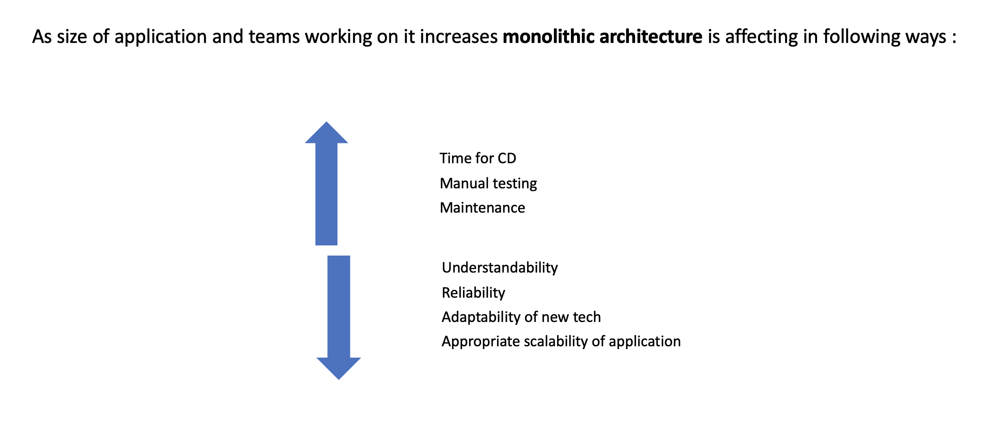

## 02-06-2023

### Problems microservices solving

- Most powerful benefits of microservices is how they force you to break your problems down into buildable pieces

- Makes the code more maintainable and testable (code is broken based on the functionality and makes it simple to maintain as they are broken and easy to hold context of small pieces)

- They give better scalability (in case of high traffic, rather than upscaling whole monolith we can now simply upscale the service where the traffic would be more)

- Allows developers to develop code in different language per service so they can choose a suitable language for that particular service's functionality

https://dzone.com/articles/what-problems-do-microservices-solve-2

### To refer on problems of using Microservices

https://www.bmc.com/blogs/microservices-challenges-when-to-avoid/

## 03-06-2023

### What are monolithic applications

- An architecture that structures the application as a single deployable and executable component.

#### Basic features of monolithic architecture

- The component contains all of the application’s subdomains.
- Since there’s a single component, all operations are local.
- Simple to develop (as designing/understanding this architecture doesn't take much time and helps for applications in starting stages of development)
- Testing is simple (as everything is at one place)
- Deployment of the whole application is done in case of changes.
- One has to run multiple instances of the application using load balancer in order to scale and improve availability of the application.
- All operations can be implemented as an ACID transaction since there’s a single database
- There’s no runtime coupling and design-time coupling as there are no multiple components

ref:
https://microservices.io/patterns/monolithic.html

