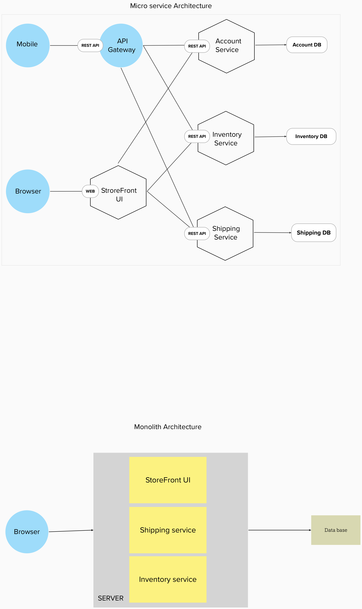

# 29-05-2023

# 12-06-2023

- Microservices-Monolith architecture. 
  https://www.atlassian.com/microservices/microservices-architecture/microservices-vs-monolith

- Target: E-commerce domain.  
  Let’s imagine that you are building an e-commerce application that takes orders from customers, verifies inventory and available credit, and ships them. The application consists of several components including the StoreFrontUI, which implements the user interface, along with some backend services for checking credit, maintaining inventory and shipping orders.   
  Sample Illustration of Micro-service and Monolith architecture of E-Commerce website

  